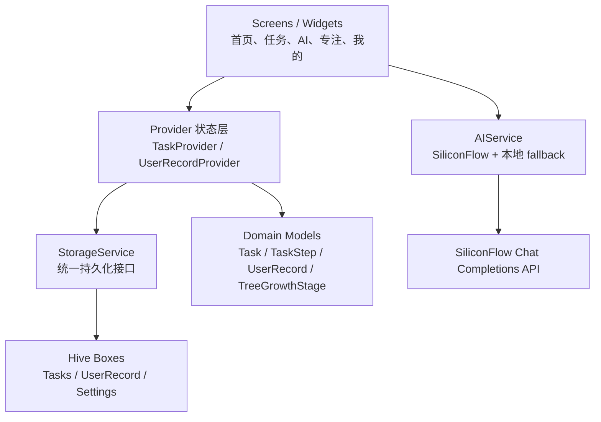
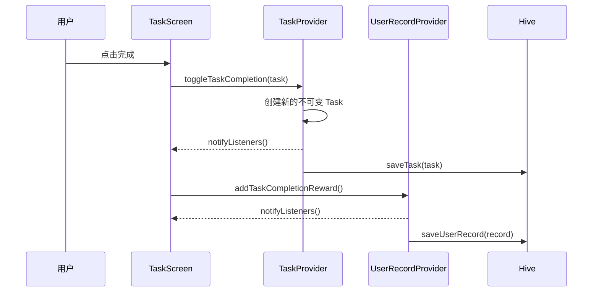

# 不拖啦

<p align="center">
  
</p>

<p align="center">
  面向大学生的柔和治愈系任务管理 App：用 AI 拆解启动阻力，用番茄钟建立专注节奏，用小树成长提供持续反馈。
</p>

## 项目简介

“不拖啦”是一款使用 Flutter 开发的本地优先任务管理应用，目标是帮助容易拖延的大学生把模糊、庞大的任务转化为可以立刻执行的小步骤。

应用采用柔和奶油色与低饱和绿色的 Soft Pastel 视觉风格，将传统待办事项、AI 任务拆解、番茄钟和成长激励整合为一套完整闭环：

1. 创建一个待办任务。
2. 使用 AI 将任务拆成 3 个短时、具体、可执行的步骤。
3. 完成全部子任务后，父任务自动完成。
4. 通过 25 分钟番茄钟进入专注状态。
5. 完成任务、签到和专注后获得能量，推动小树成长。

## 核心功能

- **首页看板**：动态问候、每日鼓励语、今日进度、能量、连续签到和待办摘要。
- **任务管理**：创建、完成、删除、筛选、高优先级标记与子任务进度展示。
- **真实 AI 拆解**：接入 SiliconFlow，通过 Qwen 模型将任务拆为 3 个可立即执行的小步骤。
- **AI 拖延急救站**：提供“不想干活”“安排今天”“拆小任务”等快捷对话入口。
- **番茄钟专注**：25 分钟倒计时、暂停、放弃确认、完成奖励和任务自动完成。
- **小树成长系统**：签到、任务完成和专注行为转化为能量，不同能量区间对应不同成长阶段。
- **本地持久化**：任务、用户记录和设置保存在 Hive 中，离线也可正常使用。
- **多端图标适配**：提供 Android Adaptive Icon、iOS、Web、Windows 和 macOS 图标资源。

## 技术路线

| 层级 | 技术 | 用途 |
| --- | --- | --- |
| 跨平台 UI | Flutter / Dart | 构建 Android、iOS、Web 与桌面端界面 |
| 状态管理 | Provider / ChangeNotifier | 管理任务、用户记录、主题与导航状态 |
| 本地数据库 | Hive / hive_flutter | 持久化任务、子任务、用户成长数据和设置 |
| 网络请求 | http / IOClient | 调用 SiliconFlow Chat Completions API |
| AI 模型 | `Qwen/Qwen2.5-7B-Instruct` | 中文聊天、任务拆解与自然语言任务解析 |
| 测试 | flutter_test | 单元测试、Provider 测试和 Widget 交互测试 |
| Android 构建 | Gradle / Kotlin | 生成 APK、配置 Adaptive Icon 与原生清单 |

## 架构设计

项目采用轻量分层架构。界面通过 Provider 读取状态，Provider 负责业务状态变更，StorageService 统一封装 Hive 读写，AIService 独立处理远端 AI 请求、响应解析和质量校验。



### 目录结构

```text
lib/
├── controllers/       # 主导航控制器
├── core/theme/        # 全局主题
├── models/            # Task、TaskStep、UserRecord、成长阶段及 Hive Adapter
├── providers/         # Provider 状态管理与业务操作
├── screens/           # 首页、任务、AI 助手、番茄钟、小树页面
├── services/          # Hive 存储与 SiliconFlow AI 服务
└── main.dart          # 应用初始化与依赖注入

test/
├── ai_service_test.dart
├── hive_storage_test.dart
├── task_provider_test.dart
└── widget_test.dart
```

## 关键数据模型

### Task

任务模型保存标题、截止时间、分类、优先级、完成状态、AI 子任务和更新时间。模型使用不可变对象与 `copyWith` 更新，降低状态被意外修改的风险。

重要派生属性：

- `subtaskProgress`：已完成子任务数 / 子任务总数。
- `isDueToday`：基于设备本地日期判断任务是否属于今天。
- `energyReward`：根据任务优先级计算完成奖励。

### UserRecord

用户记录保存能量值、连续签到天数、累计完成任务数、累计专注秒数和全清奖励信息。

### TreeGrowthStage

能量值通过区间映射为成长阶段：

| 能量范围 | 阶段 |
| --- | --- |
| `< 30` | 种子 |
| `30 - 79` | 小芽 |
| `80 - 149` | 小树苗 |
| `150 - 249` | 成长中的树 |
| `>= 250` | 茂盛大树 |

## 关键算法与业务逻辑

### 1. AI 任务拆解算法

任务拆解不是直接展示模型原始回复，而是经过“提示词约束、结构解析、质量检查、本地兜底”四个阶段：

```text
用户任务标题
  -> 构造约束提示词
  -> SiliconFlow 返回 JSON 字符串数组
  -> 解析标准 JSON
  -> 标准 JSON 失败时解析 near-JSON / 引号内容
  -> 校验数量是否等于 3
  -> 拒绝虚构 App、账号、网站、超长时长和空泛计划
  -> 保存为 TaskStep
  -> 失败时使用本地 fallback 生成可执行步骤
```

针对短英文标题，例如 `study english`，系统会额外告知模型不得虚构用户使用的 App、网站或学习材料，减少不自然的拆解结果。

### 2. AI 回复质量门控

AI 聊天回复在展示前会经过本地质量校验：

- 拒绝过短、过长或包含乱码的回复。
- 中文输入场景拒绝异常英文碎片。
- “不想干活”场景必须包含可立即执行的具体动作。
- “安排今天”场景必须要求任务清单并体现优先级思路。
- “拆小任务”场景必须要求具体任务或提供拆解动作。

不合格的远端回复不会覆盖本地即时建议，因此网络异常或模型输出异常不会让页面卡住。

### 3. 本地秒回 + 远端后台优化

AI 助手使用乐观交互策略：

1. 用户点击快捷入口或发送消息。
2. 页面立即显示本地建议，避免等待网络。
3. 使用异步请求在后台获取真实 AI 回复。
4. 远端回复通过质量门控后，再替换本地建议。

该策略兼顾了交互速度和真实 AI 能力。

### 4. 子任务联动完成

每次切换子任务完成状态后，系统重新计算所有子任务：

```text
allCompleted = subTasks.isNotEmpty && subTasks.every(isCompleted)
```

当 `allCompleted == true` 时，父任务自动标记完成并记录完成时间，避免用户重复操作。

### 5. 签到与连续天数

签到时将日期归一化到年月日进行比较：

- 当天已经签到：不重复奖励。
- 上次签到日期是昨天：连续天数 `+1`。
- 其他情况：连续天数重置为 `1`。

### 6. 番茄钟状态机

番茄钟使用 `Timer.periodic` 每秒递减：

```text
暂停/未开始 -> 开始专注 -> 每秒 timeLeft - 1
运行中 -> 暂停 -> 保留剩余时间
timeLeft == 0 -> 取消 Timer -> 完成任务 -> 增加能量 -> 返回任务页
```

页面销毁时会取消 Timer，避免资源泄漏和离开页面后继续触发状态更新。

## 数据流

以“完成任务”为例：



## AI 服务配置

项目不会在源码中保存 API Key。运行带真实 AI 的应用时，通过 `--dart-define` 注入 SiliconFlow Key：

```powershell
flutter run --dart-define=SILICONFLOW_API_KEY=你的_SiliconFlow_API_Key
```

构建 Release APK：

```powershell
flutter build apk --release --dart-define=SILICONFLOW_API_KEY=你的_SiliconFlow_API_Key
```

> 正式公开发布时，不建议把第三方 AI Key 打进客户端。生产环境应通过自有后端转发 AI 请求，并在服务端保存密钥、设置限流和鉴权。

Android 模拟器若需要通过本机代理访问 SiliconFlow，可以配置：

```powershell
adb reverse tcp:7890 tcp:7890
flutter run --dart-define=SILICONFLOW_API_KEY=你的_Key --dart-define=SILICONFLOW_DEBUG_PROXY=127.0.0.1:7890
```

## 本地运行

### 环境要求

- Flutter SDK `3.41+`
- Dart SDK `3.11+`
- Android Studio / Android SDK
- Android 7.0 或更高版本

### 启动项目

```powershell
git clone https://github.com/yuyuyu-a1t/bu-tuola.git
cd bu-tuola
flutter pub get
flutter run
```

未配置 SiliconFlow Key 时，任务管理、Hive 数据、小树成长和番茄钟仍可运行；真实 AI 请求会提示缺少配置。

## 测试与质量检查

```powershell
flutter analyze
flutter test -r expanded
```

当前测试覆盖：

- AI 配置、JSON / near-JSON 解析与回复质量门控。
- Hive 嵌套子任务和用户成长数据持久化。
- Provider 任务完成状态更新。
- 底部导航、首页跳转和 AI 快捷入口。
- 子任务全部完成后父任务自动完成。
- 番茄钟完成任务并奖励能量。

## 打包 Android APK

通用 APK：

```powershell
flutter build apk --release --dart-define=SILICONFLOW_API_KEY=你的_Key
```

按 CPU 架构拆分、减小单个 APK 大小：

```powershell
flutter build apk --release --split-per-abi --dart-define=SILICONFLOW_API_KEY=你的_Key
```

输出目录：

```text
build/app/outputs/flutter-apk/
```

## 安全说明

- 不要将 SiliconFlow API Key、Android keystore 或 `key.properties` 提交到 GitHub。
- 当前仓库忽略 `.env`、APK、构建产物、签名文件和本地图标预览。
- 正式上线前应配置独立 Android Release 签名。
- 公开发行版本应将 AI API 调用迁移到后端代理。

## 后续规划

- 云端账号与多设备同步。
- 课程表和校园日程导入。
- 可配置番茄钟时长与专注历史统计。
- 后端 AI 网关、限流与使用量管理。
- 通知提醒和桌面小组件。
- 国际化与无障碍支持。

## License

本项目当前用于学习与产品原型开发。正式开源前请补充明确的 License 文件。
